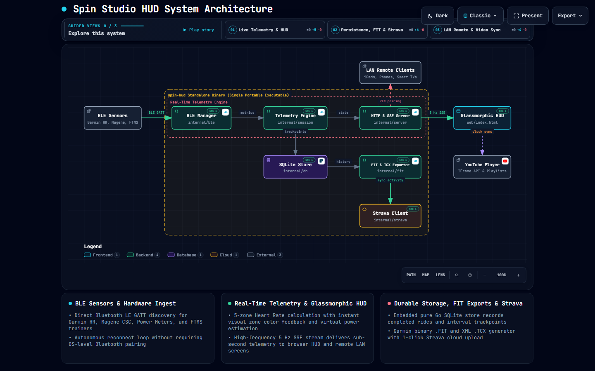

# 🚴 Spin Studio HUD & Telemetry Player

> A sleek, glassmorphic, Peloton-style workout HUD for indoor spin bikes with live Bluetooth LE telemetry (Garmin Heart Rate, Magene Cadence & Speed, Power Meters, FTMS Trainers), video-matched interval coaching programs, native Garmin FIT & TCX exports, Strava sync, and embedded fullscreen YouTube playlist video player.


---

## ⚡ Standalone & Portable (`spin-hud.exe`)

`spin-hud` is compiled as a single, self-contained standalone executable (~17 MB) with **zero external dependencies** (no Python, Node.js, or Git required on the target machine):

- **1-Click Launch**: Double-click `spin-hud.exe` to launch the background telemetry server and auto-open `http://localhost:8080` in your default browser.
- **LAN Remote Control**: Launch with `--lan` to broadcast on your local network for seamless pairing with iPads, iPhones, Android devices, and Smart TVs.
- **Auto-Discovery BLE**: Automatically discovers and connects to nearby Garmin watches, Magene sensors, Cycling Power Meters, and FTMS Smart Trainers.
- **Persistent Storage**: Built-in pure Go SQLite database persists workout logs and summary metrics across sessions.

---

## 📸 Interface Preview

| Spin Studio Live Video Workout Overlay | In-App Settings & Customization Modal |
|:---:|:---:|
|  |  |

---

## 📚 Complete Documentation Index

For in-depth guides on setup, hardware, training metrics, and developer integration, see the dedicated documentation in `docs/`:

| Guide | Description |
|---|---|
| 🏛️ [**System Architecture (Interactive)**](docs/spin-hud-architecture.html) | Interactive system map generated with Archify (BLE GATT ingest, 5 Hz SSE stream, SQLite storage, and Strava sync) |
| 🛠️ [**Hardware & Sensors Guide**](docs/HARDWARE_AND_SENSORS.md) | Pairing Garmin 965 HR, Magene S3+ Cadence/Speed, Power Meters, FTMS Trainers, and flywheel calibration |
| 🚴 [**Workouts & File Importer**](docs/WORKOUTS_AND_IMPORTING.md) | Video-matched profiles, interval coaching cues, and importing `.zwo` (Zwift), `.mrc`, `.erg`, and JSON files |
| 📱 [**LAN & Remote Control**](docs/LAN_REMOTE_CONTROL.md) | Multi-device setups (tablets/phones/TVs), `--lan` mode, 6-digit PIN pairing security, and auto-401 authentication |
| 📊 [**Metrics, History & Exports**](docs/METRICS_AND_EXPORTS.md) | HR zones, virtual vs. real power (W/kg), ride history in SQLite, Garmin `.FIT` / `.TCX` downloads, and Strava upload |
| 📡 [**REST & SSE API Reference**](docs/API_REFERENCE.md) | Complete HTTP and 5 Hz Server-Sent Events API reference for developers and automation |

---

## 🏛️ System Architecture



> **Interactive System Map**: Explore the interactive diagram with guided views (Live Telemetry Pipeline, SQLite Persistence & Strava Upload, Multi-Device LAN Control) at [`docs/spin-hud-architecture.html`](docs/spin-hud-architecture.html). Generated with [Archify](https://github.com/tt-a1i/archify).

---

## ✨ Key Features at a Glance

### 1. 🚴 Glassmorphic Telemetry HUD & Real-Time Metrics
- **Live Bluetooth LE Gauges**: Real-time **Heart Rate** (with color-coded 5 HR zones), **Cadence (RPM)**, **Wheel Speed (mph)**, and **Power (Watts)**.
- **Virtual Power & Smart Trainer Support**: Real-time wattage calculated via calibrated virtual resistance curves, dedicated cycling power meters (`0x1818`), or FTMS trainers (`0x1826`).
- **Advanced Training Analytics**: Real-time **Normalized Power (NP)**, **Training Stress Score (TSS)**, **Intensity Factor (IF)**, and work output (kJ).

### 2. 🎬 Video-Matched Intensity Profiles & Workout Importer
- **Frame-Accurate Video Clock Sync**: Interval countdowns, target RPM, and effort ratings lock directly to YouTube workout video timestamps. Scrubbing or pausing the video automatically syncs workout phase cards.
- **Multi-Format Workout Importer**: Drag-and-drop or import `.zwo` (Zwift workout XML), `.mrc`, `.erg`, or JSON workout files directly into your workout library.

### 3. 📊 Activity History, FIT & TCX Exports, Strava Sync
- **SQLite History**: Automatically records every completed ride into a local SQLite database.
- **Garmin .FIT & .TCX Exports**: 1-click download of industry-standard binary `.FIT` and `.TCX` activity files.
- **Direct Strava Upload**: Authenticate once via OAuth 2.0 to upload rides straight to your Strava feed.

---

## 🛠️ Supported Hardware Matrix

| Hardware Category | Supported Protocols / Devices | Notes |
|---|---|---|
| **Heart Rate** | Garmin Forerunner (965, etc.), Chest Straps, Armbands | BLE Heart Rate Service (`0x180D`) |
| **Cadence Sensor** | Magene S3+, Wahoo RPM, Garmin Cadence | BLE CSC Service (`0x1816` Cadence) on crank arm |
| **Speed Sensor** | Magene S3+ (Green mode), Garmin Speed | BLE CSC Service (`0x1816` Wheel Speed) on flywheel hub |
| **Power Meters** | Stages, 4iiii, Favero Assioma, Garmin Rally | BLE Cycling Power Service (`0x1818`) |
| **Smart Trainers** | Wahoo KICKR, Tacx, Saris, Magene T300 | BLE Fitness Machine Service (`0x1826` FTMS) |

---

## 🚀 Quickstart & Usage

### Running the Standalone Executable

1. **Local Mode (Default)**:
   ```powershell
   spin-hud.exe
   ```
2. **LAN Multi-Screen Mode**:
   ```powershell
   spin-hud.exe --lan
   ```
   *Displays local IP and 6-digit pairing PIN for phones/tablets.*

### CLI Options

| Flag | Default | Description |
|---|---|---|
| `--port` | `8080` | Web server port |
| `--lan` | `false` | Listen on `0.0.0.0` for LAN access |
| `--pin` | *(random)* | Custom 6-digit LAN pairing PIN |
| `--db` | `spin_hud.db` | Custom path to SQLite database file |
| `--playlist` | *(default)* | Custom YouTube Playlist ID or URL |
| `--scan` | `false` | Scan and display nearby BLE devices in console |
| `--self-check`| `false` | Run internal parser and mathematical self-checks |
| `--no-browser`| `false` | Do not automatically open browser on startup |

---

## 🏗️ Building from Source (Go 1.25+)

```powershell
# Clone the repository
git clone https://github.com/ailonagellert/spin-hud.git
cd spin-hud

# Run test suites
go test -count=1 ./...
python test_build.py

# Build single standalone binary
go build -o spin-hud.exe .
```

---

## 📄 License
MIT License. Crafted for high-energy indoor spin workouts. 🚴💨
