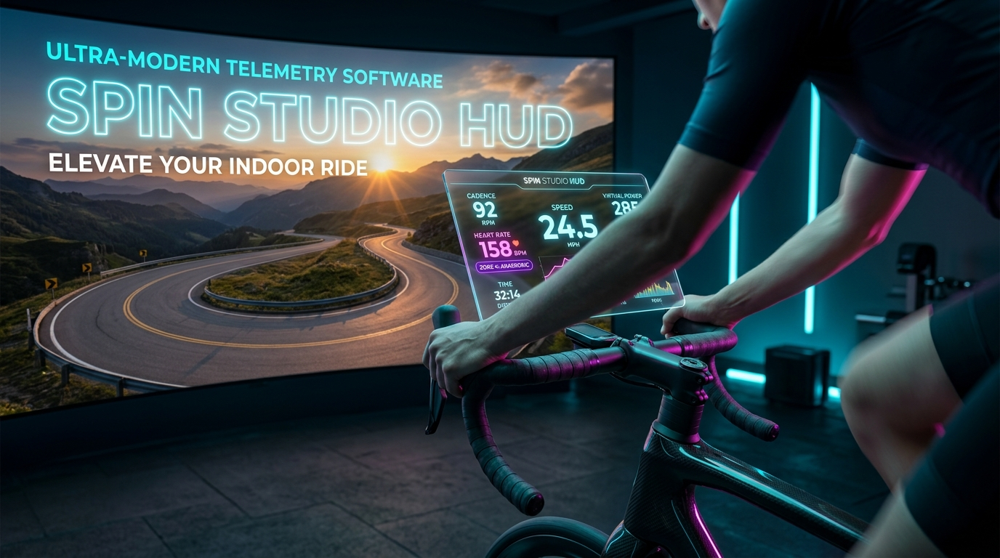
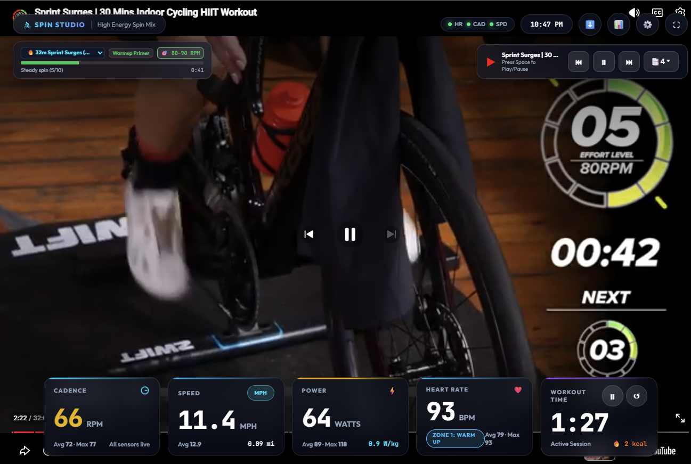
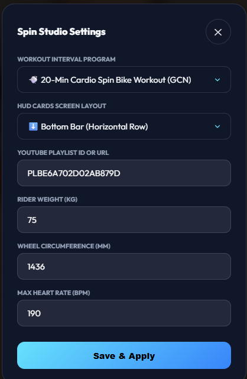

# 🚴 Spin Studio HUD & Telemetry Player

> A sleek, glassmorphic, Peloton-style workout HUD for indoor spin bikes with live Bluetooth LE telemetry (Garmin Heart Rate, Magene Cadence & Speed), virtual power meter, video-matched interval coaching programs, Strava/Garmin .TCX export, and embedded fullscreen YouTube playlist video player.



---

## ⚡ Standalone & Portable (`spin-hud.exe`)

`spin-hud` is compiled as a single, self-contained standalone executable (~10 MB) with **zero external dependencies** (no Python, Node.js, or Git required):
- **Embedded Web Engine**: Responsive HTML5/CSS/JS frontend baked directly inside the Go binary.
- **Native Windows BLE**: Direct WinRT Bluetooth LE integration for multi-sensor scanning and instant auto-reconnect.
- **1-Click Launch**: Double-click `spin-hud.exe` to launch the background telemetry server and auto-open `http://localhost:8080` in your default browser.
- **Zero-Stale Cache**: Built-in aggressive HTTP cache-invalidation headers (`Cache-Control: no-cache, no-store, must-revalidate`) ensure seamless instant updates on browser refresh.

---

## 📸 Screenshots & Interface

| Spin Studio Live Video Workout Overlay | In-App Settings & Customization Modal |
| :---: | :---: |
|  |  |
| *Live HUD with Cadence, Speed, Power, Heart Rate & Video Sync* | *Configure Playlist, Interval Programs, Wheel Size & Max HR* |

> *Tip: Additional screenshots of alternative layouts (Left Vertical Stack, Right Vertical Stack, Post-Workout Achievement Summary, and Tablet/iPad UI) can be placed in the [`img/`](img/) directory.*

---

## ✨ Key Features

### 1. 🚴 Movable Glassmorphic Telemetry HUD
- **3 Dynamic Layout Modes**:
  - **⬇️ Bottom Dock** *(Default)*: Traditional horizontal dock spanning the bottom of the screen with compact metric cards.
  - **⬅️ Left Stack**: 380px vertical sidebar stacked flush on the left below the workout cue card.
  - **➡️ Right Stack**: 380px vertical sidebar stacked flush on the right below the YouTube controls.
- **Instant Layout Switching**: Press **`L`** on your keyboard, click the **⬇️ / ⬅️ / ➡️** icon in the top toolbar, or change it in **⚙️ Settings**. Preferences persist in browser `localStorage`.
- **Cadence (RPM)**: Real-time crank RPM with synchronized rotating crank animation, target cadence guides (e.g. 80–100 RPM), and live **Average / Max** cadence stats.
- **Speed & Distance (MPH / km/h)**: Live wheel speed with 1-click unit toggle, cumulative workout distance (miles/km), and live **Average / Max** speed stats.
- **Heart Rate & Dynamic Zones (BPM)**: Real-time pulse from Garmin watches / BLE chest straps, animated pulse icon, dynamic Heart Rate Zone badge (**Zone 1 Warm Up** to **Zone 5 Max Peak** with color coding), and live **Average / Max** HR stats.
- **Virtual Power Meter (Watts & W/kg)**: Real-time calculated virtual cycling power based on speed, cadence, flywheel inertia, and rider weight.
- **Workout Timer & Energy (kcal)**: Session stopwatch (`MM:SS`), **Start / Pause** toggle (`⏸` / `▶`), workout reset, and active estimated calorie burn counter (kcal).
- **Live Wall Clock**: High-contrast real-time clock displayed directly in the top toolbar.

### 2. 🎬 Video-Matched Intensity Profiles & Frame-Accurate Auto-Sync
- **Frame-Accurate Video Clock Sync**: In video-matched workout modes, interval countdowns and targets lock directly to `player.getCurrentTime()`. Pausing, seeking, or scrubbing the video timeline automatically updates the interval cue card, remaining phase countdown, target RPM, and effort rating to match the on-screen coach.
- **Pre-Configured Workout Profiles**:
  - **`🚴 30m Sweet Spot Endurance`** (`V-HmspieYjE`): 20 timed phases with exact RPE ratings (2/10 to 9/10), 80–90 RPM base holds, 100–110 RPM cadence surges, and sprint finish.
  - **`⚡ 30m The Full Pyramid HIIT`** (`eNyVyngn0l8`): 23 timed phases stepping up 1/10 to 10/10 MAX effort peak sprint (115–130 RPM) and descending back down.
  - **`🔥 32m Sprint Surges HIIT`** (`pH4ISSkJ4bw`): 25 timed phases with 8x 30-second all-out 10/10 sprint bursts (100–130 RPM) interspersed across sweet spot blocks.
  - **`💨 20m Cardio Spin`** (`4Ek31_3PMW4`): 20 timed phases alternating standing climbs (70–80 RPM) and seated high-speed surges (90–100 RPM).
  - *Standard Interval Modes*: Free Ride, 20m HIIT Fat Burn, 30m Cardio Climb, 45m Endurance, 15m Sprint Ladders, 10m Warm-Up/Cool-Down.

### 3. 🔄 2-Way Sync: Workout Video Selector ↔ Workout Programs
- **Selecting from Playlist (`📑 List` Drawer / Track Skip)**: Choosing a video in the playlist drawer (or when the player auto-advances) automatically selects its matching workout program in the dropdown and updates HUD targets.
- **Selecting from Program Dropdown**: Selecting a video-matched program immediately cues and starts that video in the YouTube player.
- **Visual Badges**: Playlist drawer displays glowing cyan badges (e.g. `[30m Sweet Spot]`, `[30m Full Pyramid]`) indicating structured coaching tracks.

### 4. 📊 Post-Workout Summary & .TCX Export
- **Achievement Modal (`S` key or `📊` button)**: Displays total duration, distance, calories burned, and Average/Max breakdowns for Heart Rate, Cadence, Speed, and Power.
- **1-Click .TCX Export**: Downloads standardized `.TCX` activity files compatible with **Strava**, **Garmin Connect**, and **TrainingPeaks**.

### 5. ⚡ Robust Multi-Device BLE Engine
- **Concurrent Independent Connection Loops**: Independent discovery and read loops for Heart Rate, Cadence, and Speed sensors.
- **1–2s Auto-Reconnect**: Seamlessly recovers connection when waking sensors from sleep mode without interrupting other active devices.
- **Fast-Connect Cache**: Caches paired device MAC addresses to disk (`~/.spin_hud_devices.json`) for instant reconnection on startup.
- **Smart Device Identification**: Automatic prioritized sensor mapping for Magene dual-mode sensors (`57177-1` crank cadence, `40452-1` hub speed).

---

## 🖥️ Cross-Platform Support & Architecture

`spin-hud` can run both as a native local app or as a network telemetry hub:

### 1. Native Binary Host Platforms (Runs BLE + Server Engine)
| Platform / Architecture | Target Devices | BLE Backend |
| :--- | :--- | :--- |
| **Windows x64** (`windows/amd64`) | Windows laptops & desktops beside spin bike | Pure Go WinRT Bluetooth API |
| **Windows ARM64** (`windows/arm64`) | Snapdragon X Elite, Surface Pro | Pure Go WinRT Bluetooth API |
| **Linux ARM64** (`linux/arm64`) | **Raspberry Pi 4 / 5 / Zero 2W**, Linux SBCs | Pure Go BlueZ D-Bus (`godbus/dbus`) — **No CGo!** |
| **Linux ARMv7** (`linux/arm`) | Raspberry Pi 2 / 3 (32-bit OS) | Pure Go BlueZ D-Bus |
| **Linux x64** (`linux/amd64`) | Intel NUC, Mini PCs, Linux desktops, Steam Deck | Pure Go BlueZ D-Bus |
| **macOS Apple Silicon & Intel** (`darwin/arm64`, `darwin/amd64`) | MacBook, Mac Mini, Mac Studio | CoreBluetooth framework (`cbgo`) |

### 2. Client Display Platforms (Any Screen via `--lan`)
Because the Go binary embeds the full responsive Web HUD and serves it over HTTP/WebSockets:
- **iPads & iPhones**: Mount an iPad or phone on the bike handlebars (`http://<server-ip>:8080`).
- **Android Tablets & Phones**: Fullscreen Chrome/Firefox HUD.
- **Smart TVs & Media Boxes**: Apple TV, Android TV, Fire TV, or Chromecast with Google TV web browser.
- **Peloton & Smart Gym Consoles**: Any Android-based bike screen with a web browser.
- **Dual Screens**: Run the HUD simultaneously on a laptop and a large wall TV.

### 💡 Dedicated Bike Hub Setup:
- Mount a headless **Raspberry Pi Zero 2W or Pi 4** under the bike frame.
- Pi auto-boots on power, captures BLE heart rate & cadence, and broadcasts the live HUD to your iPad or wall TV with `--lan`.

---

## 🛠️ Hardware Setup Guide

```
+------------------------------------+
|  Garmin Forerunner 965 / Fenix    |
|  - ANT+ -> Magene Sensors (Logs)   |
|  - BLE  -> Spin-HUD Laptop (HR)    |
+------------------------------------+
                  | (BLE 0x180D Heart Rate)
                  v
+------------------------------------+         +-------------------------------+
|  Magene S3+ Cadence (RED LED)      |-(BLE)-> |                               |
|  - Crank Arm (0x1816 Cadence)      |         |  Spin-HUD Engine & Web Player  |
+------------------------------------+         |  (http://localhost:8080)       |
+------------------------------------+         |                               |
|  Magene S3+ Speed (GREEN LED)      |-(BLE)-> |                               |
|  - Flywheel Hub (0x1816 Speed)     |         +-------------------------------+
+------------------------------------+
```

### 1. Garmin Watch (Heart Rate)
- **Garmin Forerunner 965 / Fenix / Instinct / Venu**:
  - **Option A (Broadcast Heart Rate)**: Go to *Settings → Sensors & Accessories → Wrist Heart Rate → Broadcast Heart Rate → Start*.
  - **Option B (Virtual Run / Indoor Bike)**: Start a *Virtual Run* or *Indoor Bike* activity with HR broadcast enabled.
  - *Pro-Tip*: Pair your Magene cadence/speed sensors to your Garmin watch using **ANT+** so the watch records your complete workout while leaving the single Bluetooth LE channel open for your laptop.

### 2. Magene S3+ Cadence Sensor (Crank)
- Remove and re-insert the CR2032 battery until the **RED LED** flashes (Cadence Mode).
- Mount on the inside of the non-drive crank arm using the rubber strap.

### 3. Magene S3+ Speed Sensor (Wheel / Flywheel Hub)
- Remove and re-insert the CR2032 battery until the **GREEN LED** flashes (Speed Mode).
- Mount on the flywheel hub or wheel center.
- *Note*: Ensure phone Bluetooth is disconnected or mobile fitness apps (e.g. Garmin Connect / Strava phone apps) are force-closed so they do not claim the Magene sensor's single Bluetooth slot.

---

## 📐 Wheel Circumference Calibration

The HUD calculates speed and distance by tracking full 360° angular revolutions of the wheel/flywheel.

| Setup / Bike Type | Diameter | Circumference (mm) |
|---|---|---|
| **Indoor Spin Bike (18" Flywheel)** *(Default)* | **18.0 in** | **`1436 mm`** |
| Indoor Spin Bike (20" Flywheel) | 20.0 in | `1596 mm` |
| Standard Road Bike (700x23c) | 26.3 in | `2096 mm` |
| Standard Road Bike (700x25c) | 26.5 in | `2105 mm` |
| Mountain Bike (29 x 2.25) | 29.0 in | `2282 mm` |

*Customize wheel circumference, playlist ID, rider weight, and max HR at any time via the in-app **⚙️ Settings** modal.*

---

## 🚀 Quickstart

### 1. Clone & Build (Go 1.21+)

```bash
# Clone the repository
git clone https://github.com/ailonagellert/spin-hud.git
cd spin-hud

# Build standalone Windows binary
go build -o spin-hud.exe main.go

# Run
./spin-hud.exe
```

> **Direct Run**: You can also run immediately without building: `go run main.go`

### 2. Cross-Platform Builds

```bash
# Linux (Raspberry Pi ARM64)
GOOS=linux GOARCH=arm64 go build -o spin-hud main.go

# Linux (x64)
GOOS=linux GOARCH=amd64 go build -o spin-hud main.go

# macOS (Apple Silicon)
GOOS=darwin GOARCH=arm64 go build -o spin-hud main.go
```

### 3. Command-Line Options

```bash
# Launch with custom YouTube playlist
./spin-hud.exe --playlist "https://youtube.com/playlist?list=YOUR_PLAYLIST_ID"

# Enable LAN access (open on iPad/tablet at http://<server-ip>:8080)
./spin-hud.exe --lan

# Run on custom port without auto-opening browser
./spin-hud.exe --port 9000 --no-browser

# Scan nearby BLE fitness sensors
./spin-hud.exe --scan

# Run parser & session engine self-check
./spin-hud.exe --self-check
```

### 4. Python Prototype (Alternative)
```bash
pip install -r requirements.txt
python spin_hud.py
```

---

## ⌨️ Keyboard Shortcuts

| Shortcut | Action |
|---|---|
| **`L`** | Cycle HUD Card Layouts (**⬇️ Bottom** → **⬅️ Left Stack** → **➡️ Right Stack**) |
| **`Space`** | Play / Pause YouTube workout video & sync timer |
| **`N`** | Next track in playlist |
| **`P`** | Previous track in playlist |
| **`F`** | Toggle Fullscreen mode |
| **`H`** | Toggle HUD Telemetry overlay (hide / show) |
| **`S`** | Toggle Post-Workout Summary dialog & .TCX export |

---

## 📡 API Endpoints

The built-in HTTP server provides lightweight REST & SSE endpoints:

- `GET /` — Fullscreen Spin Studio web interface.
- `GET /api/telemetry` — Server-Sent Events (SSE) stream providing 5Hz live telemetry snapshots (`hr`, `avg_hr`, `max_hr`, `cadence`, `avg_cadence`, `max_cadence`, `speed_mph`, `avg_speed_mph`, `distance_mi`, `power_w`, `w_kg`, `calories`, `elapsed_sec`, `is_running`, `sensors`).
- `GET /api/youtube/title?id=<VIDEO_ID>` — Async cached video title resolution.
- `POST /api/workout/toggle` — Toggle Start / Pause state of the workout timer.
- `POST /api/workout/reset` — Reset elapsed duration, distance, calories, and averages.
- `POST /api/settings` — Update YouTube playlist ID, wheel circumference (mm), maximum HR, or rider weight.

---

## 🧪 Testing & Validation

```bash
# Run Go unit test suite
go test ./...

# Run Python / parser validation self-check
python test_build.py
spin-hud.exe --self-check
```

---

## 📄 License
MIT License. Crafted for high-energy indoor spin workouts. 🚴💨
